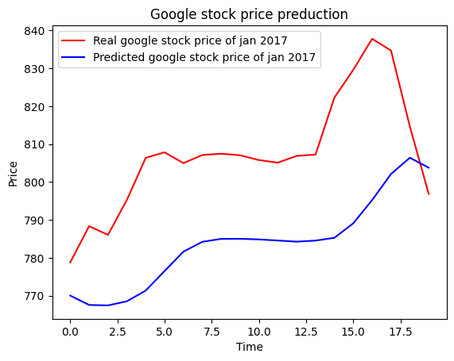

# Stock Price Predictor using RNN

This project demonstrates a Recurrent Neural Network (RNN) model to predict the stock price of Google. The model is trained using historical stock price data and is able to predict future stock prices based on patterns observed in the training data.

## Introduction
Stock price prediction is a challenging task due to the volatile nature of financial markets. This project aims to use a Recurrent Neural Network (RNN) to model the sequential nature of stock price data and predict future prices.

## Dataset
The dataset used to train the RNN is Google's stock price data from the year 2012 to 2016. We aim to predict only the Open price of stocks on a particular day
Testing the RNN for the stock prices of 2017.

## Model Architecture
The RNN model consists of the following layers:
- **Input Layer**: Takes the historical stock price data.
- **LSTM Layers**: Two LSTM layers with 50 units each to capture the temporal dependencies.
- **Dropout Layers**: Dropout regularization to prevent overfitting.
- **Dense Layer**: A fully connected layer with one unit to predict the stock price.

## Training the Model
The model is trained using the Mean Squared Error (MSE) loss function and the Adam optimizer. The data is preprocessed by scaling and reshaping to fit the input requirements of the LSTM layers.

## Results
The trained model is able to predict the stock price of Google for January 2017. The predicted prices are visualized alongside the actual prices to evaluate the performance of the model.



## Installation
To run this project locally, follow these steps:

1. Clone the repository:
   ```bash
   git clone https://github.com/your-username/stock-price-predictor-rnn.git
   ```

2. Navigate to the project directory:
   ```bash
   cd stock-price-predictor-rnn
   ```

3. Install the required dependencies:
   ```bash
   pip install -r requirements.txt
   ```

## Usage
1. Run the Jupyter notebook to train the model and make predictions:
   ```bash
   jupyter notebook Stock_price_predictor_RNN.ipynb
   ```

2. Follow the instructions in the notebook to preprocess the data, train the model, and visualize the results.


---

Feel free to customize this README file further to better suit your project. If you have any additional details or specific sections you'd like to include, let me know!
